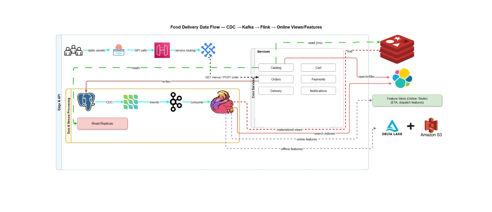

# Food Delivery Data Pipeline (CDC → Kafka → Flink → Online Views/Features)



> Production‑grade, containerized data pipeline for a food‑delivery platform.  
> PostgreSQL change data capture (CDC) → Kafka → Flink SQL materialized views →
> OpenSearch (search/analytics) + Redis (online features) with optional Delta Lake for offline analytics.

---

## Table of Contents
- [Goals](#goals)
- [Stack](#stack)
- [Repository Layout](#repository-layout)
- [Quick Start](#quick-start)
- [Operations](#operations)
- [Configuration](#configuration)
- [Verification](#verification)
- [Troubleshooting](#troubleshooting)
- [Development](#development)
- [Versioning & Releases](#versioning--releases)
- [Contributing](#contributing)
- [License](#license)

---

## Goals
- Illustrate a **near real‑time** data flow from OLTP (PostgreSQL) into **streaming views** consumed by services.
- Keep everything **local-first** via Docker Compose while matching production topology.
- Provide **scripts** to register connectors, fetch Flink JARs and submit SQL jobs reproducibly.
- Offer **observability hooks** and **repeatable verification** commands.

## Stack
The exact versions come from the Docker images in `docker/docker-compose.yml`.  
Fill/update the table below to reflect your image tags (see [`VERSIONS.md`](VERSIONS.md)).

| Component          | Role                               | Notes / Version (example) |
|-------------------|------------------------------------|---------------------------|
| PostgreSQL        | OLTP, CDC source                    | 17.x (logical decoding)   |
| Debezium          | CDC (Postgres connector)            | 3.2.x                     |
| Kafka + Connect   | Event backbone + Connect runtime    | Kafka 4.x                 |
| Flink             | Stream processing (SQL)             | 1.18.x                    |
| OpenSearch        | Search/analytics sink               | 2.x                       |
| Redis             | Online feature store                | 7.x                       |
| Optional: Spark   | Offline Delta Lake batch            | 3.x                       |

> **Tip:** Only commit `.env.example`. Put sensitive values in your local `.env` (ignored).

## Repository Layout
```
docker/                # Compose, service configs, Flink SQL (if bundled)
scripts/               # Helper scripts to automate the flow
services/api/          # Example HTTP API (optional)
consumers/redis_consumer/  # Example Redis consumer
flink/                 # Flink config & SQL (alt structure)
data-gen/              # Synthetic data generators
docs/                  # Diagrams & docs (architecture.jpg)
.github/workflows/     # CI (lint builds)
```

## Quick Start

### 0) Prerequisites
- Docker Engine 24+ and **Docker Compose v2**
- Git, curl
- Linux/macOS or Windows (WSL2 recommended)

### 1) Configure environment
Copy the example and edit values:
```bash
cp docker/.env.example docker/.env
# Edit docker/.env and set passwords, ports if needed
```

### 2) Start the stack
```bash
docker compose -f docker/docker-compose.yml up -d
```

Wait until all services are **healthy**:
```bash
docker compose -f docker/docker-compose.yml ps
```

### 3) Download Flink connector JARs (one-time or when versions change)
```bash
bash scripts/get_flink_jars.sh
```

### 4) Register Kafka Connectors (CDC source + OpenSearch sink)
```bash
bash scripts/register_connectors.sh
```

### 5) Submit Flink SQL job(s)
```bash
bash scripts/sql_submit.sh
```

### 6) (Optional) Generate sample data
```bash
# Catalog & orders generators (adjust args as needed)
python3 data-gen/generate_catalog.py
python3 data-gen/generate_orders.py
```

## Operations

Common commands:

```bash
# Stop / Start
docker compose -f docker/docker-compose.yml down
docker compose -f docker/docker-compose.yml up -d

# Logs
docker compose -f docker/docker-compose.yml logs -f connect
docker compose -f docker/docker-compose.yml logs -f flink-jobmanager
docker compose -f docker/docker-compose.yml logs -f kafka

# Reset the OpenSearch index (dangerous)
curl -ksu admin:$OS_PASS -XDELETE https://localhost:9200/views.orders_summary

# Pause/Resume a connector
curl -s -X PUT http://localhost:8083/connectors/os-views/pause
curl -s -X PUT http://localhost:8083/connectors/os-views/resume
```

## Configuration

Key places to look:
- `docker/.env` - runtime credentials and ports (see `docker/.env.example`)
- `docker/docker-compose.yml` - image tags, volumes and network
- `scripts/register_connectors.sh` - payloads for Kafka Connect (CDC + sink)
- `scripts/sql_submit.sh` - Flink SQL files to execute

### Environment Variables (excerpt)
| Variable    | Where               | Description                                  |
|-------------|---------------------|----------------------------------------------|
| `OS_PASS`   | your shell / .env   | OpenSearch admin password (basic auth)       |
| `POSTGRES_*`| docker/.env         | Postgres database, user, password            |
| `CONNECT_URL` | scripts            | Kafka Connect REST URL (default `http://localhost:8083`) |

## Verification

Once the job runs, confirm the sink index exists and has docs:

```bash
# Health & indices
curl -ksu admin:$OS_PASS https://localhost:9200 -I | head -n1
curl -ksu admin:$OS_PASS 'https://localhost:9200/_cat/indices?v'

# Query the view
curl -ksu admin:$OS_PASS 'https://localhost:9200/views.orders_summary/_search?size=5&pretty'
```

Kafka topic & consumer group checks:
```bash
docker compose -f docker/docker-compose.yml exec -T connect   bash -lc "kafka-topics.sh --bootstrap-server kafka:9092 --describe --topic views.orders_summary"

docker compose -f docker/docker-compose.yml exec -T connect   bash -lc "kafka-consumer-groups.sh --bootstrap-server kafka:9092             --group connect-os-views --describe"
```

## Troubleshooting

- **CRLF ↔ LF warnings on Windows**  
  This repo ships a `.gitattributes` forcing LF for code/scripts. After pulling, run:
  ```bash
  git config core.autocrlf false
  git rm --cached -r . && git reset --hard
  ```

- **“Connector configuration is invalid” / class is abstract**  
  Ensure SMTs use the canonical names, e.g. `org.apache.kafka.connect.transforms.ExtractField$Key`.

- **Resetting consumer offsets says group is Active/Stable**  
  Pause the connector first, wait ~10s, then reset:
  ```bash
  curl -s -X PUT http://localhost:8083/connectors/os-views/pause
  docker compose -f docker/docker-compose.yml exec -T connect     bash -lc "kafka-consumer-groups.sh --bootstrap-server kafka:9092               --group connect-os-views --reset-offsets --to-earliest               --topic views.orders_summary --execute"
  curl -s -X PUT http://localhost:8083/connectors/os-views/resume
  ```

- **OpenSearch cert verification**  
  For local dev we disable cert verification with `connection.ssl.verify.certificate=false`. Do not use this in prod.

## Development

- Python tooling (optional): `ruff`, `black`, `pytest`
- Shell: `shellcheck`
- CI runs basic lint on PRs (see `.github/workflows/ci.yml`).

## Versioning & Releases

- We follow **SemVer** (`MAJOR.MINOR.PATCH`).
- Release notes live in [`CHANGELOG.md`](CHANGELOG.md).
- Component versions are documented in [`VERSIONS.md`](VERSIONS.md).

## Contributing
See [`CONTRIBUTING.md`](CONTRIBUTING.md). PRs welcome!

## License
MIT - see [`LICENSE`](LICENSE).
